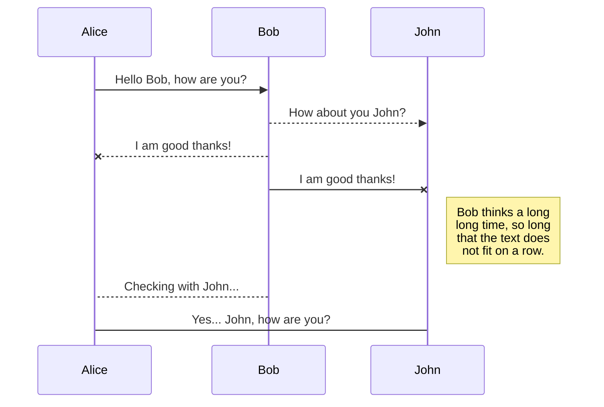
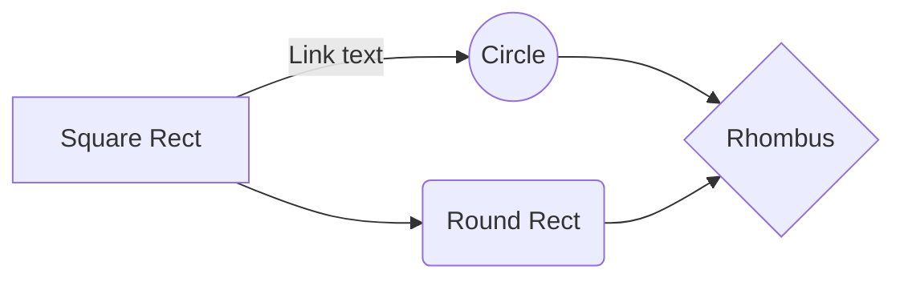

# Projet CY-Météo

## Description
CY-Météo est un projet combinant **shell** et **C**.
À partir de données météorologique, le programme permet de générer différents graphiques. Ces graphiques dépendront de certaine variable que vous spécifierez.

## Synopsis
./cymeteo [fichier] [types de données] [options]

## Arguments obligatoires

Certains types d'arguments sont obligatoires :

Arguments de type de données : **-t** ou **-p** ou **-w** ou **-m** ou **-h** 
Au moins un de ces arguments doit être présent. Il est possible d'en indiquer plusieurs en même temps.

Argument de fichier : **-f** 

|argument        |signification |description
|----------------|--------------|-----------------------------------------
|**-f**          |fichier       |Argument à placer avant le nom du fichier.
|**-h**          |altitude      |Produit l’altitude pour chaque station, triées par ordre décroissant.
|**-m**          |humidité      |Produit l’humidité maximale pour chaque station, triées par ordre décroissant.
|**-p1**         |pression      |Produit les pressions minimales, maximales et moyennes par station, dans l’ordre croissant du numéro de station.
|**-p2**         |pression      |Produit les pressions moyennes par date/heure, triées dans l’ordre chronologique. La moyenne se fait sur toutes les stations.
|**-p3**         |pression      |Produit les pressions par date/heure par station, triées par ordre chronologique.
|**-t1**         |températures  |Produit les températures minimales, maximales et moyennes par station, dans l’ordre croissant du numéro de station.
|**-t2**         |températures  |Produit les températures moyennes par date/heure, triées dans l’ordre chronologique. La moyenne se fait sur toutes les stations.
|**-t3**         |températures  |Produit les températures  par date/heure par station. Elles seront triées par ordre chronologique.
|**-w**          |vent          |Produit l’orientation moyenne et la vitesse moyenne des vents (moyenne des composantes). Les données seront triées par identifiant croissant de la station.

## Options

**note :**
 - Les arguments de **lieu** (**-F**, **-G**, **-S**, **-A**, **-O**, **-Q**) **ne peuvent pas être combinés entre eux**.
 - Les arguments **-a** et **-g** peuvent être combinés, mais ne peuvent pas être utilisés avec des arguments de lieu.

 
|argument        |signification           |description
|----------------|------------------------|-------------------------------------
|**-a**          |latitude                |Argument à placer avant de préciser un intervalle de latitudes pour la recherche. Cette option peut être utilisée indépendamment de l'option -g. Ex: -a -15.90 50.154
|**-d**          |date                    |Argument à placer avant de préciser un intervalle de dates pour la recherche. Ex: -d 2000-01-01 2000-12-31
|**-g**          |longitude               |Argument à placer avant de préciser un intervalle de longitudes pour la recherche. Cette option peut être utilisée indépendamment de l'option -a. Ex: -g -15.90 50.154
|**-A**          |Antilles                |Utilise uniquement les données provenant des Antilles.
|**-F**          |France                  |Utilise uniquement les données provenant de France métropolitaine.
|**-G**          |Guyane française        |Utilise uniquement les données provenant de le Guyane française.
|**-O**          |Océan indien            |Utilise uniquement les données provenant de l'Océan indien.
|**-Q**          |Antarctique             |Utilise uniquement les données provenant de l'Antarctique.
|**-S**          |Saint-Pierre et Miquelon|Utilise uniquement les données provenant de Saint-Pierre et Miquelon.
|**--abr**       |tri                     |Tri effectué l’aide d’une structure de type ABR.
|**--avl**       |tri                     |Tri effectué l’aide d’une structure de type AVL.
|**--help**      |aide                    |Afficher l'aide.
|**--tab**       |tri                     |Tri effectué à l’aide d’un tableau.

## Fichiers

## Auteurs

\
\
\
\
\
\
\
\
\
\
\
\
\
\
\
\
\
\
\

## UML diagrams

You can render UML diagrams using [Mermaid](https://mermaidjs.github.io/). For example, this will produce a sequence diagram:

And this will produce a flow chart:

